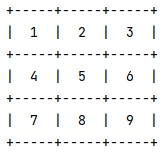

# Tic-Tac-Toe game
## Idea:
Original idea comes from [Python Essentials 1 course](https://edube.org/study/pe1)1 by Python Institute. The game was a task finishing the course.

Initial requirements were quite simple, thus I decided to develop the game further, e.g. by implementing the winning algorithm by [Świstak codes](https://swistak.codes/post/algorytmika-gier-kolko-i-krzyzyk/#strategia-wygrywania-w-kółko-i-krzyżyk)2 on the basis of the [Kevin Crowley and Robert S. Siegler article](https://onlinelibrary.wiley.com/doi/abs/10.1207/s15516709cog1704_3)3

## How to play:
The rules are typical to Tic-Tac-Toe. The board consists of 9 squares. Initially the board looks like this:

If the square contains a number from 1 to 9, it is empty and can be marked by entering its number. "X" mark denotes a computer square and "O" mark deontates a user square

## References:
1. Python Essentials 1 course: [Edube](https://edube.org/study/pe1).
2. Świstak T. 2021. Algorytmika gier — kółko i krzyżyk *(EN: Algorythmization of Games - Tic-Tac-Toe)*: [Świstak Codes](swistak.codes/post/algorytmika-gier-kolko-i-krzyzyk/).
3. Crowley K, Siegler RS. 1993. Flexible Strategy Use in Young Children's Tic-Tac-Toe. Cognitive Science, 17(4):531–61: [Wiley Online Library](https://onlinelibrary.wiley.com/doi/abs/10.1207/s15516709cog1704_3).